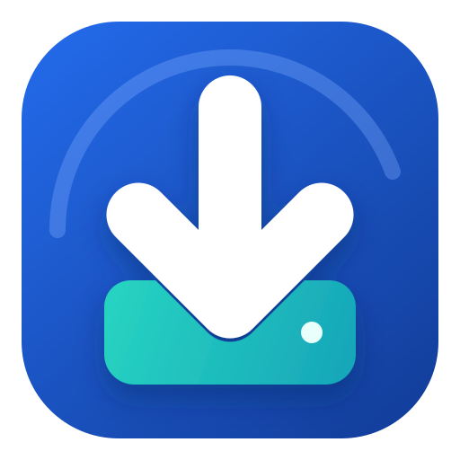
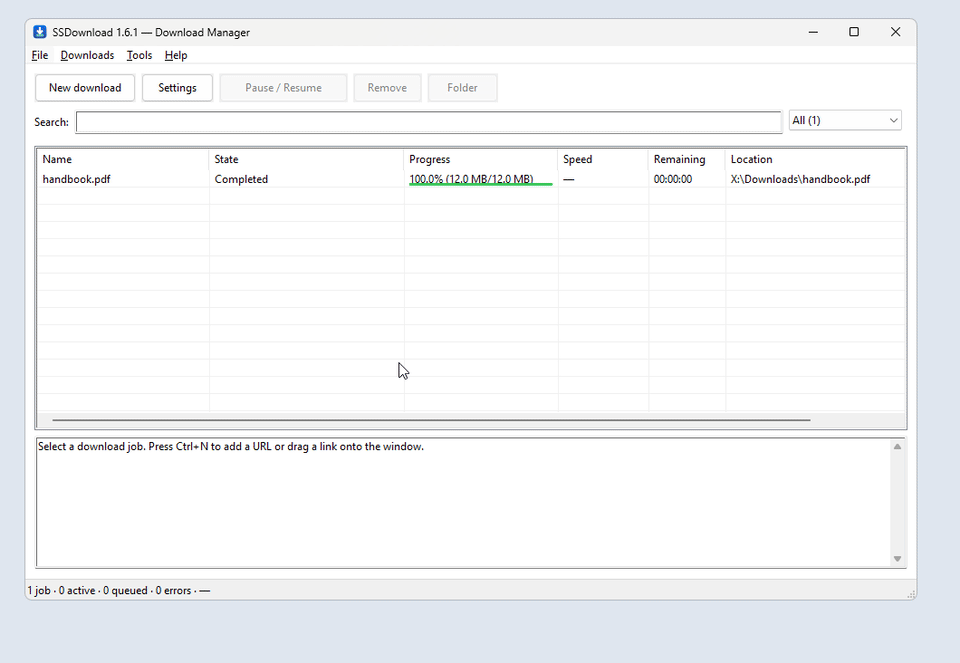
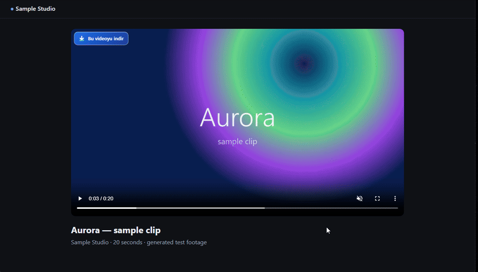

<p align="center">
  
</p>

<h1 align="center">SSDownload</h1>

<p align="center">
  A fast, private download manager for Windows: files, video and audio, with a browser button that sends media straight to the app.
</p>

<p align="center">
  <a href="https://github.com/isolmaz/SSDownload/releases/latest"></a>
  
  <a href="https://github.com/isolmaz/SSDownload/actions/workflows/ci.yml"></a>
  <a href="LICENSE.txt"></a>
</p>

<p align="center">
  
</p>

## Features

- **Fast, resumable downloads** over up to 16 connections per file. A download resumes only when the server proves the file is unchanged, and a finished file never overwrites an existing one.
- **Video and audio** from the page you are watching: choose the quality, container, audio and subtitle tracks, or save as MP3. Every result is checked with FFmpeg before it is published.
- **Browser extension** for Chrome and Edge: a download button on videos, right-click entries and optional download takeover.
- **A tidy queue:** drag to reorder, pause and resume, speed limits, a mini panel, completion cards and tray controls.
- **For larger jobs:** named queues with time windows, folder rules, batch ranges, a site crawler, a command line and signed automatic updates.
- **Private by design:** no account, no telemetry, no server. Everything stays on your PC.

<p align="center">
  
</p>

## Install

1. Download **`SSDownload-<version>-Setup.exe`** (or the portable ZIP) from the [latest release](https://github.com/isolmaz/SSDownload/releases/latest) and run it. No administrator rights are needed.
2. Add the browser extension: open `chrome://extensions` (or `edge://extensions`), turn on **Developer mode**, click **Load unpacked** and choose the `browser\chromium` folder in the install directory. **Tools → Browser setup** opens it for you.
3. That's it. Media support (yt-dlp, FFmpeg, Deno) installs itself on first start, each file verified against its published SHA-256.

The builds are not code-signed yet, so SmartScreen may warn on first run. The release page lists the SHA-256 of every file. Installed copies update themselves after you accept the signed update.

The app speaks **Turkish and English** (Settings → General). The browser extension's own text is currently Turkish only.

## Documentation

| | |
|---|---|
| [User guide](docs/GUIDE.md) | Menus, settings, shortcuts, recovery and the command line |
| [Privacy](PRIVACY.md) | What is stored, and the only connections the app makes |
| [Security](SECURITY.md) | Security model and how to report a vulnerability privately |
| [Contributing](CONTRIBUTING.md) | Building from source, local checks and code layout |

## Build from source

Requires Windows 10/11 x64, the Visual Studio C++ Build Tools and [rustup](https://rustup.rs).

```powershell
cargo build --release --locked
```

Checks run locally with `scripts\check.ps1` and on every pull request in GitHub Actions. See [CONTRIBUTING.md](CONTRIBUTING.md) for details.

## License

[MIT](LICENSE.txt). yt-dlp, FFmpeg and Deno are not bundled; the app downloads them from their official releases. See [THIRD-PARTY-NOTICES.txt](THIRD-PARTY-NOTICES.txt).

Download only content you have the right to download. DRM-protected streams are not supported.
